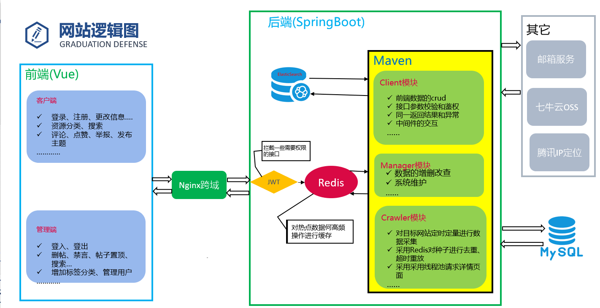

# 网盘分享小站模块简介

`项目演示地址:http://panshare.top/	测试账号：62643349@qq.com	密码：123456`

`后台演示地址：http://manager.panshare.top/	测试账号：admin 密码：123456`

`前端项目地址：https://gitee.com/hjs-creat/pan-share`

## 项目技术选型

**后端选型**

1.  轮子（版本详见各个模块的pom文件）

    >   SpringBoot、MybatisPlus、Jwt、Swagger、Jsoup、Hibernate-Validator、Spring-Aop、Spring-Email、Spring-Quartz、Lombok……

2.  中间件

    >   Redis6.X、ElasticSearch7.6、Nginx

3.  其它

    >   MySql5.7、七牛云OSS、腾讯ip定位、QQ邮箱服务

**前端选型**

>   Vue、Element-UI、WangEdit、Axios、Vue-Router、qs、vue-puzzle-vcode、js-cookie……

## 网站架构图

## 部署环境配置(待完善)

>   由于爬虫模块容易泄露服务器真实IP，之前部署后服务器被攻击变成了矿机:sob:，所以后续没有部署该模块。

## 相关技术细节和TODO请看各个模块下的README.md！
